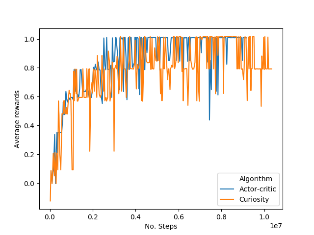
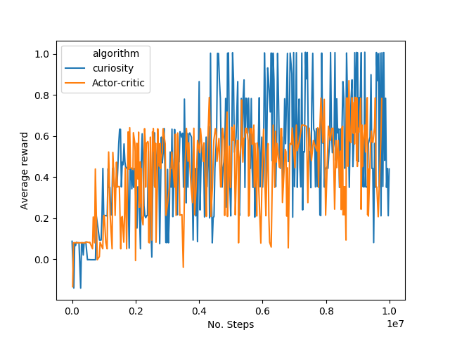

# Mario
Pytorch Implemtation of Actor-Critic (A3C) and [curiosity driven exploration](https://pathak22.github.io/noreward-rl/) for [SuperMarioBros](https://goo.gl/z8sK8b). Idea is to train agent with intrinsic curiosity-based motivation (ICM) when external rewards from environment are sparse. 

  
 
## Prerequisites
- Python3.5+
- PyTorch 0.4.0
- OpenAI Gym ==0.10.8
```
pip3 install -r requirements.txt
```

## Training
First, create a folder (name it "save") in your workspace (os.path). In the save folder, create a .csv file for storing all the log (name it mario_curves.csv). Now you are good to go.

Clone the repository
```
git clone https://github.com/Ameyapores/Mario
cd Mario
```

For Actor-critic (A3C), use the following command-
```
python3 /A3C/main.py 
```

For Curiosity (ICM+A3C), use the following command-
```
python3 /curiosity/main.py 
```
This would create 4 workers running parallely.


## Results
1) Dense reward setting



2) Sparse reward setting



